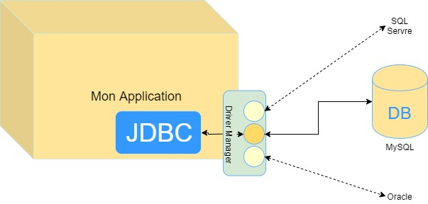

# JDBC

Alors la JDBC (Java Database Connectivity) est une API(application programming interface ) pour communique avec un service hosting, ce deriner est un base de donnees pour gere cette base de donnees(selectioner, insere, modfier ou supremer).

## la presentation de JDBC avec une schema :



## Driver Manager

le plus important c'est le Driver Manager et il est que permeton nous de communique avec quelconque le engine de base de donnees(MySQL, SQL Server ou Oracle). Le driver manager c'est que create un JDBC connexion.
le Driver Manager c'est que communique entre les drivers desponilble(driver pour MySQL, drivers pour SQL Server et drivre Oracle) et mon application, aussi gere l'etablissement d'une connexion entre une base de donnees et le pilote approprie.

## L'implimentation

les JDBC Classes sont dans le package `java.sql` et `javax.sql`.
pour un premier pas on a besoin de les classes suivantes:

1. **DriverManager**

    * >```Connection``` *getConnextion(...)*
    * >```int``` *getLoginTimeout(...)*
    * >*registerDriver(...)*

1. **Connection**

    * >```Statement``` createStatement(...)
    * >close()

1. **Statement**

    * >```ResultSet``` executeQuery(...)
    * >```boolean``` execute(...)

1. **ResultSet**
    * >```Boolean``` next()
    * >```T``` get**T**(...) // T : (Boolean, Integer, String, Date, ...)